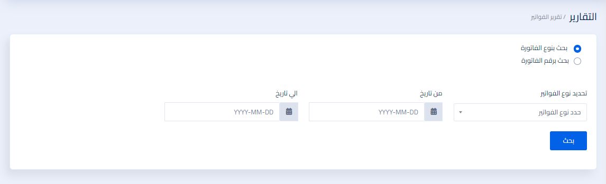
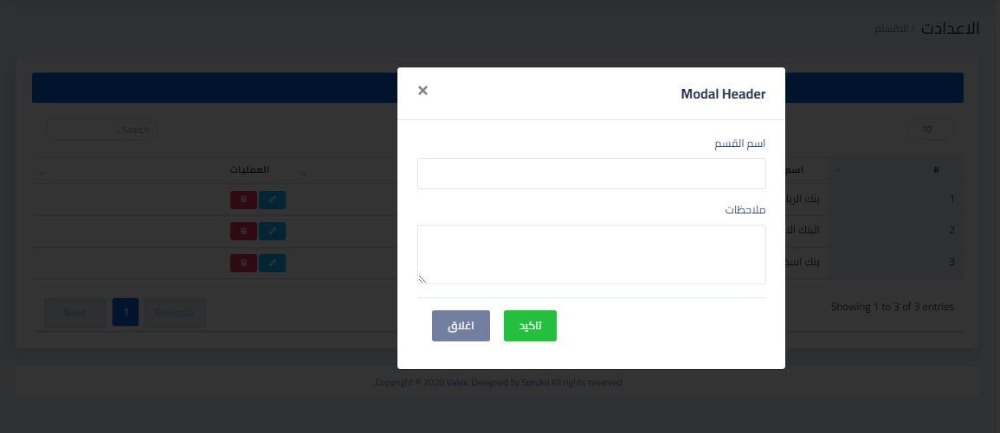
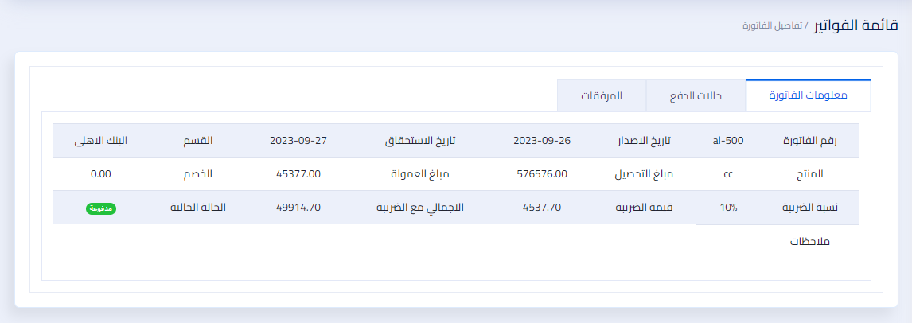

# Invoices Project Using Laravel

A new Web project.

## Getting Started

`
The Invoices Project is a comprehensive system designed to streamline the invoice management process. It provides an intuitive interface for administrators and users to add, view, and manage invoices, along with their payment details. The system also includes features such as printing invoices and user management with varying permissions.
The system revolves around three main sections: the Department Section, the Product Section, and the Invoices Section. These sections can be managed by both the admin and users with appropriate permissions.
In the Department Section, the admin and authorized users can create, edit, and delete departments. This allows for better organization and categorization of invoices based on the respective departments.
Similarly, in the Product Section, the admin and authorized users can add, update, and delete products. This section enables the management of a comprehensive product catalog to select from when creating invoices.
Moving to the Invoices Section, the admin and authorized users have the ability to add new invoices to the system. They can input all the necessary details, such as invoice number, date, customer information, product selection, and payment details. The system stores this information securely and allows for easy retrieval and modification if needed.

`

## Features:

-   Login screen.
-   Statistics page.
-   Invoices department.
-   Section department.
-   Product department.
-   List of users.
-   Users permitions management
-   Dashboard for admin to manage all users and reports
-   Admin can send mails to users
-   Email notification
-   Print invoices

## Used Technologies

-   Valex Dashboard
-   HTML
-   CSS
-   JavaScript
-   Jquery
-   Bootstrap
-   AJAX
-   PHP
-   Laravel Framework
-   MySQL Database

## Note

The project is not complete yet, but it is almost done.

#### Screenshots

